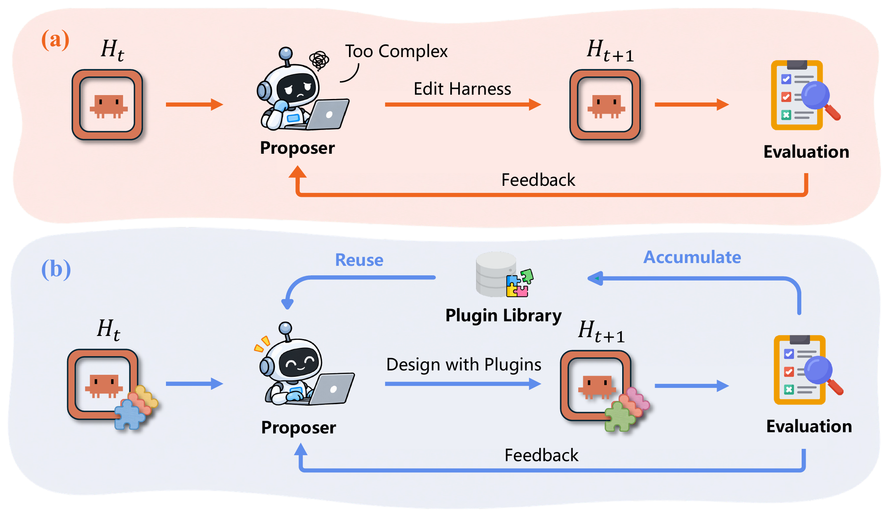
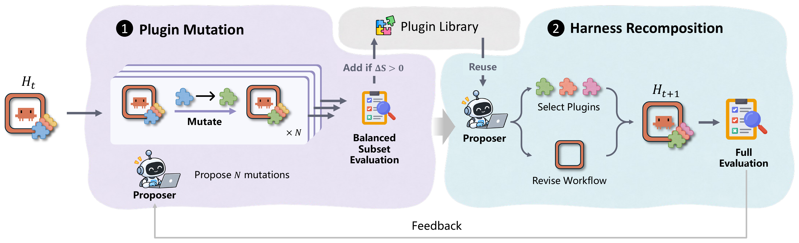

<div align="center">

# 🧩 PluginRSI

### Recursive Improvement of Agent Harnesses with Reusable Plugins

<p>
  <a href="https://arxiv.org/abs/2609.32423"></a>
  <a href="https://huggingface.co/papers/2609.32423"></a>
  
  
  
</p>

<p><i>“Everything is a plugin.”</i></p>



</div>

**PluginRSI** represents an agent harness as a **workflow** over **atomized plugins**: roles, tools, skills and memory.
Rather than rewriting the whole harness at each step, it improves individual plugins, keeps the ones that help
in a shared **plugin library**, and recomposes them into new harnesses. Mechanisms found in one iteration remain
available in later ones.

## ✨ Highlights

- 🔬 **Plugin mutation**: *N* parallel branches each mutate one plugin on a balanced minibatch of solved and failed tasks. The rest of the harness stays fixed.
- 📚 **Plugin library**: a variant is added to the library only if it beats its parent on the same minibatch.
- 🔀 **Harness recomposition**: the proposer selects plugins from the updated library and revises the workflow. The new harness must improve full held-in accuracy to replace the incumbent.
- 🔁 **Reusable across runs**: starting from the initial harness with the evolved library reaches 69% held-out on SWE-bench Verified after two steps, compared with 65% without the library.

## 🏗️ Method

<div align="center">

</div>

| Paper | Code |
| --- | --- |
| Optimization loop (Alg. 1) | [`search/loop.py`](src/pluginrsi/search/loop.py) |
| ① Plugin mutation + balanced minibatch | [`search/mutation.py`](src/pluginrsi/search/mutation.py) |
| ② Harness recomposition | `Search.harness_recomposition` in [`search/loop.py`](src/pluginrsi/search/loop.py) |
| Proposer instructions | [`prompts/`](src/pluginrsi/prompts) |
| Plugin schema `H(W, P)` | [`schemas.py`](src/pluginrsi/schemas.py), [`loader.py`](src/pluginrsi/loader.py), [`contracts.py`](src/pluginrsi/contracts.py) |
| Initial harnesses `H₀` | [`seeds/agents/`](seeds/agents) |
| Initial plugin library `L` | [`seeds/plugin_library/`](seeds/plugin_library) |

## 📊 Results

<div align="center">

| Held-out | ReAct (few-shot) | GEPA | DGM | Meta-Harness | **PluginRSI** |
| --- | :---: | :---: | :---: | :---: | :---: |
| SWE-bench Verified (Kimi-K3) | 47.0 | 62.0 | 55.0 | 63.0 | **69.0** |
| SWE-bench Verified (GPT-5.6 Terra) | 55.0 | 51.0 | 50.0 | 55.0 | **65.0** |
| Terminal-Bench 2.1 (Kimi-K3) | 50.0<sup>†</sup> | 63.3 | 60.0 | 66.7 | **73.3** |
| QA transfer, 5 unseen domains (Kimi-K3) | 0.332 | 0.472 | — | 0.568 | **0.588** |

<sub>Resolve rate (%) or accuracy on held-out splits. Each SWE-bench row lists the harness optimized and evaluated with that model. <sup>†</sup>Zero-shot ReAct. Full tables and cross-model transfer results are in the paper.</sub>

</div>

## 🚀 Quick Start

```bash
# 1. Install (Python 3.11+; Docker is needed for SWE-bench / Terminal-Bench)
python3 -m venv .venv && source .venv/bin/activate
pip install -e '.[test,data,qa,harbor]'
cp .env.example .env            # fill in SOLVER_* / EVOLVER_* endpoints

# 2. Prepare data (pick a benchmark: swe | terminal_bench | qa_transfer)
mkdir -p logs
python3 scripts/prepare_hf_data.py swe 2>&1 | tee logs/prepare_swe.log

# 3. Set the model names in configs/swe.yaml, then check and launch
bash scripts/launch_experiment.sh check --config configs/swe.yaml
bash scripts/launch_experiment.sh start --config configs/swe.yaml
```

## 🤖 Let Your Coding Agent Do It

The detailed procedures live in agent skills under [`.claude/skills/`](.claude/skills), so you don't
have to read a manual. Open the repository in [Claude Code](https://claude.com/claude-code) and ask in plain
language; the matching skill loads automatically.

| Skill | What it covers | Try asking |
| --- | --- | --- |
| [`pluginrsi-reproduce`](.claude/skills/pluginrsi-reproduce/SKILL.md) | Install, data download, model & sandbox settings, launch, resume, held-out report | *"Reproduce the SWE-bench Verified experiment with my endpoint."* |
| [`pluginrsi-extend`](.claude/skills/pluginrsi-extend/SKILL.md) | Write plugins, add benchmarks, change the search algorithm, offline tests | *"Add a new search stage that prunes unused plugins after recomposition."* |

Using another agent (Codex, Cursor, Gemini CLI, ...)? Tell it to read the relevant `SKILL.md` first.
The full reference is in [`reference.md`](.claude/skills/pluginrsi-reproduce/reference.md).

## 📁 Repository Layout

```text
PluginRSI/
├── src/pluginrsi/          # core package (CLI: `pluginrsi`)
│   ├── search/             #   PluginRSI loop (loop.py, mutation.py) and proposer agent
│   ├── prompts/            #   proposer instructions for each stage
│   └── evaluation/         #   benchmark runners and graders
├── seeds/
│   ├── agents/             # initial harnesses (workflow + harness.yaml)
│   ├── plugin_library/     # initial plugin library (role / tool / skill / memory)
│   └── plugin_library_qa/  # plugin library for QA transfer
├── configs/                # swe.yaml · terminal_bench.yaml · qa_transfer.yaml
├── datasets/               # fixed held-in / held-out split IDs
├── scripts/                # data preparation and experiment launcher
└── .claude/skills/         # agent skills: reproduce · extend
```

## 📄 License

Released under the [MIT License](LICENSE).

## 📝 Citation

```bibtex
@article{pluginrsi2026,
  title   = {PluginRSI: Recursive Improvement of Agent Harnesses with Reusable Plugins},
  author  = {TODO},
  journal = {arXiv preprint arXiv:2609.32423},
  year    = {2026}
}
```
